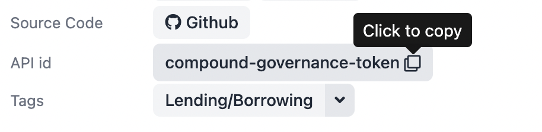

# 2. Write the CryptoStats adapter

It's time to build our adapter!

Every adapter will be a bit different, depending on which data sources are being accessed.

As an example, we'll build an adapter for ENS registration fees. The ENS adapter uses many common
adapter conventions, such as querying block numbers on given dates, querying a subgraph, and
fetching an asset price.

## Open the CryptoStats editor and create a new fee adapter

Visit the [CryptoStats adapter editor](https://cryptostats.community), and click "New Adapter" in
the top right corner. Select the "Fee Revenue Adapter" template, to create a new adapter to edit.

You'll see a new Typescript document, which contains some metadata exports at the top, and one large
"setup" function. You can update the `name` field on line 1 to describe the adapter you're building.
For our case, we'll call it "ENS Fees".

## Send queries and calculate the fees

Inside the "setup" function, you'll see another function named getFees. This function will execute all
the queries and computations needed to query our fees.

We're going to be querying fees from the [dmihal/ens-fees subgraph](https://thegraph.com/hosted-service/subgraph/dmihal/ens-fees).
This subgraph accumulates the total fees paid in ETH from all time.

_(The subgraph also tracks the total fees paid in USD, but we'll ignore that for the purpose of this tutorial)_

We'll calculate the fees spent in one day by querying the total ETH fees at the _end_ of the day, and
subtracting the total ETH fees at the _beginning_ of the day. We'll then multiply that value by the price
of ETH on that day to reach our final value.

_Total fees in USD = (total fees at end of day - total fees at beginning of day) * ETH price_

### Query the block numbers on given dates

You'll notice that the first few lines of the function have the following queries:

```ts
const startOfDayBlock = await sdk.chainData.getBlockNumber(date, 'ethereum');
const nextDayDate = sdk.date.offsetDaysFormatted(date, 1);
const endOfDayBlock = await sdk.chainData.getBlockNumber(nextDayDate, 'ethereum');
```

For our subgraph query, we'll need the Ethereum block numbers on the _beginning_ and _end_ of
the date that we're querying.

### Query the subgraph

Next, we'll execute our query on the [dmihal/ens-fees subgraph](https://thegraph.com/hosted-service/subgraph/dmihal/ens-fees):

```ts
const data = await sdk.graph.query(
  'dmihal/ens-fees',
  `query txFees($startOfDay: Int!, $endOfDay: Int!){
    startOfDay: ens(id: "ens", block: {number: $startOfDay}) {
      ethCollected
    }
    endOfDay: ens(id: "ens", block: {number: $endOfDay}) {
      ethCollected
    }
  }`,
  {
    startOfDay: startOfDayBlock,
    endOfDay: endOfDayBlock,
  },
);

const feesInETH = parseFloat(data.endOfDay.ethCollected) - parseFloat(data.startOfDay.ethCollected);
```

Note that we're using [time-travel queries](https://thegraph.com/docs/en/developer/graphql-api/#time-travel-queries)
to get the fees at the start and end of the day (using the block numbers we queried in the last step).

Finally, we subtract the two values to get the total ETH spent in the day.

### Query the ETH price

Now that we have the total fees in ETH, we need the ETH price so we can convert into USD.

Thankfully, we can query price data from CoinGecko with a simple call:

```ts
const ethPrice = await sdk.coinGecko.getHistoricalPrice('ethereum', date);
```

Note that we have to pass the CoinGecko API ID for any asset. You can find the CoinGecko ID on the
page for any asset:



We can now multiply our two values, and return them from the function:

```ts
return feesInETH * ethPrice;
```

### Register the adapter

Now, we need to make sure that our function is registered as a query, attached to the ENS subadapter.

Towards the bottom of the file, find the `sdk.register(` call. This function will register a subadapter
in the containing list, along with any queries and metadata.

First, you can update the "id" field, we'll use "ens" for ours. The ID is used internally to identify
sub-adapters.

Next, make sure that the query is added to the "queries" object. All queries are registered by a query ID
that defines what type of data is fetched by executing the query. You can see a full list of the standard
queries on the [Standard Queries page](/building-adapters/standard-queries).

```
sdk.register({
  id: 'ens',
  queries: {
    oneDayTotalFees: getFees,
  },
  metadata: {
    ...
```

### Test the query

Now it's time to make sure your queries actually work! On the right side of the editor, open up
the "test" tab. You'll see the the oneDayTotalFees query for our ENS adapter, with a field to
insert the date to query.

Select a date, click "Run Query", and you should see the result outputted.

If you need to debug your adapter, you might want to add a `console.log` line to your code. However,
`console.log` is unavailable inside CryptoStats adapters. Instead use `sdk.log()`, and the output
will be displayed in the "Console" panel at the bottom of the editor.

## Add Metadata

In addition to queries, every CryptoStats adapter contains metadata about the protocols they represent.

You can copy the fields below into your metadata object. The fields should be self-explanitory.

```ts
    ...
  metadata: {
    name: 'ENS',
    protocolLaunch: '2020-08-07',
    category: 'other',
    description: 'ENS is a naming protocol for wallets, websites and more.',
    feeDescription: 'Registration fees are paid to the DAO treasury.',
    blockchain: 'Ethereum',
    source: 'The Graph Protocol',
    website: 'https://ens.domains',
    events: [
      {
        date: '2021-11-09',
        description: 'ENS DAO & token launched',
      },
    ],
  },
});
```

On the "preview" tab on the right side of the page, you should see all the fields inserted.

### Upload an icon

One field that we're missing from our metadata is an icon. To add an image to our adapter, we'll
have to upload it to IPFS, and use a special function to include it in the adapter.

First, download this ENS logo:


_SVG logos are always preferred, due to their smaller size and scalability._

Next, click the "Image Library" button in the bottom left of the editor page. In the popup, you'll
be able to upload the image you just downloaded, and add it to the ENS adapter.

Once adding it to your adapter, you should see the ENS icon in the Preview tab as well.

## Final code

Your adapter should now have code similar to this:

```ts
export const name = 'ENS Fees';
export const version = '0.0.1';
export const license = 'MIT';

export function setup(sdk: Context) {
  const getFees = async (date: string): Promise<number> => {
    const startOfDayBlock = await sdk.chainData.getBlockNumber(date, 'ethereum');
    const nextDayDate = sdk.date.offsetDaysFormatted(date, 1);
    const endOfDayBlock = await sdk.chainData.getBlockNumber(nextDayDate, 'ethereum');

    const data = await sdk.graph.query(
      'dmihal/ens-fees',
      `query txFees($startOfDay: Int!, $endOfDay: Int!){
        startOfDay: ens(id: "ens", block: {number: $startOfDay}) {
          ethCollected
        }
        endOfDay: ens(id: "ens", block: {number: $endOfDay}) {
          ethCollected
        }
      }`,
      {
        startOfDay: startOfDayBlock,
        endOfDay: endOfDayBlock,
      },
    );

    const feesInETH = parseFloat(data.endOfDay.usdCollected) - parseFloat(data.startOfDay.usdCollected);

    const ethPrice = await sdk.coinGecko.getHistoricalPrice('ethereum', date);

    return feesInETH * ethPrice;
  }

  sdk.register({
    id: 'ens',
    queries: {
      oneDayTotalFees: getFees,
    },
    metadata: {
      name: 'ENS',
      icon: sdk.ipfs.getDataURILoader('QmcVVHX9MmeJkATvuhNBhVUL4sXqNuU5eT6m6W47E2yxnN', 'image/svg+xml'),
      protocolLaunch: '2020-08-07',
      category: 'other',
      description: 'ENS is a naming protocol for wallets, websites and more.',
      feeDescription: 'Registration fees are paid to the DAO treasury.',
      blockchain: 'Ethereum',
      source: 'The Graph Protocol',
      website: 'https://ens.domains',
      events: [
        {
          date: '2021-11-09',
          description: 'ENS DAO & token launched',
        },
      ],
    },
  })
}

```

## Next step: publish your adapter

Now that your adapter is done, it's time to share it with the world!

[3. Publish an adapter and submit it for review](./publish-submit-adapter)
