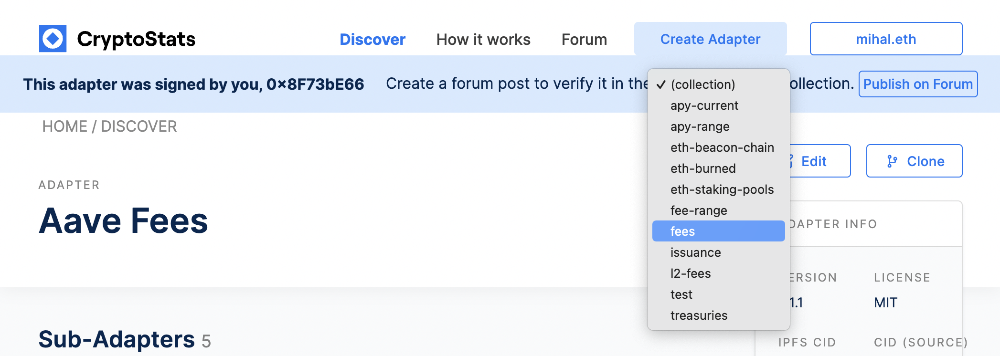

# 3. Publish an adapter and submit it for review

Our adapter is all coded up, we've tested that the queries are accurate, and added appropriate metadata.

Now it's time to publish our adapter and share it with the world!

## Signing and publishing the adapter

Click the "Publish to IPFS" button in the bottom right corner of the editor UI. A popup will open,
which will explain the publication process, and prompt you to connect your Ethereum wallet.

Once you've connected your wallet, you'll be prompted to sign the adapter with your Ethereum address.
This is an off-chain signature, which won't send any transaction or cost any money.

After signing the adapter, the adapter will be published to IPFS, and you'll see a link to open the
preview page for the adapter.

## Submitting the adapter to be included in a collection

After opening the preview page for your adapter, you should see the all the metadata and queries that
you created, as well as the source code. This is the page that the CryptoStats community will review
to determine whether to verify your adapter and include it in a collection.

But first, you must chose which collection to submit your adapter to be included in.

At the top of the screen, you should see a blue bar, stating that the adapter was created by you, and
to "Create a forum post to verify it in the (collection) collection". Open up that dropdown, and
chose the collection that you would like the adapter to be submitted for.

Since we built an adapter for ENS fees, we'll submit it to the "fees" collection. However, you might
build other adapters later for other collections. You can see the [full list of collections](/building-adapters/collections),
or propose a new collection be created on [the forum](https://forum.cryptostats.community).

### Sharing the adapter with the community

Once you've picked your collection, click the "Publish on Forum" button to open a new post on the
CryptoStats forum.

_(If you don't have a forum account yet, you may need to create an account, sign in, then click the
"Publish on Forum" button again.)_

Since you're creating a new adapter, write a short bit about the protocol, how the protocol meets the
listing criteria, and where the adapter pulls data form.

Once you post this, you might want to also share the link to your forum post in the
[CryptoStats Discord server](https://cryptostats.community/discord) to ensure that the verifiers see it.

That's it! Hopefully your adapter will be accepted, and added to CryptoStats collection of resources!
